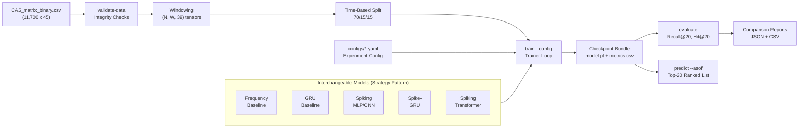
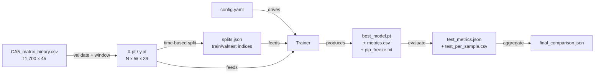
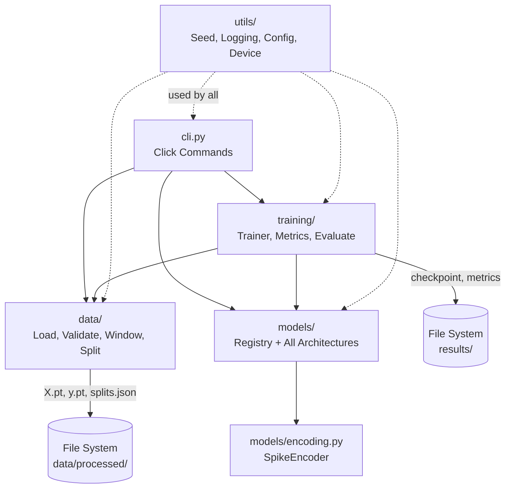
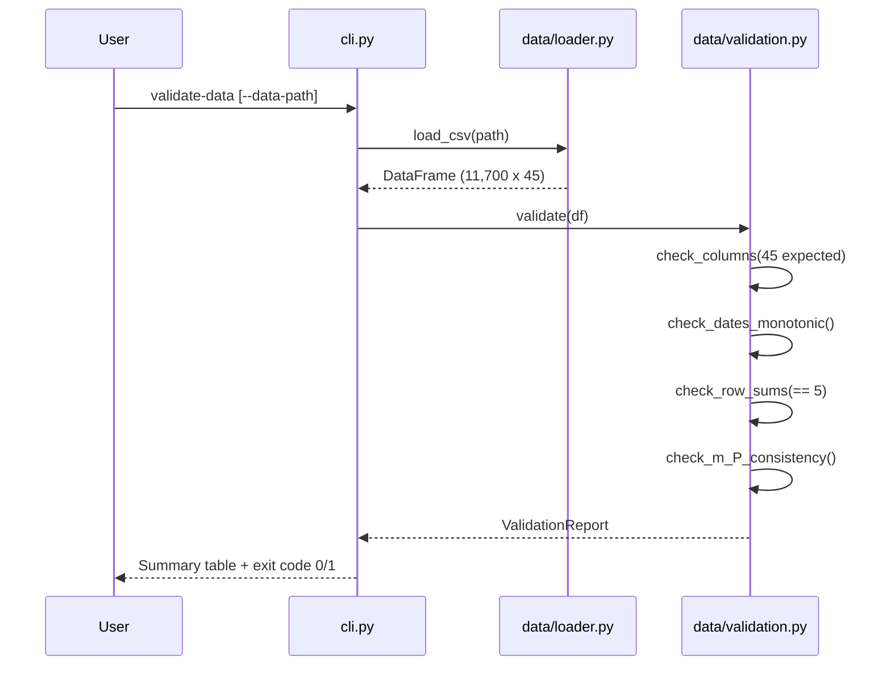
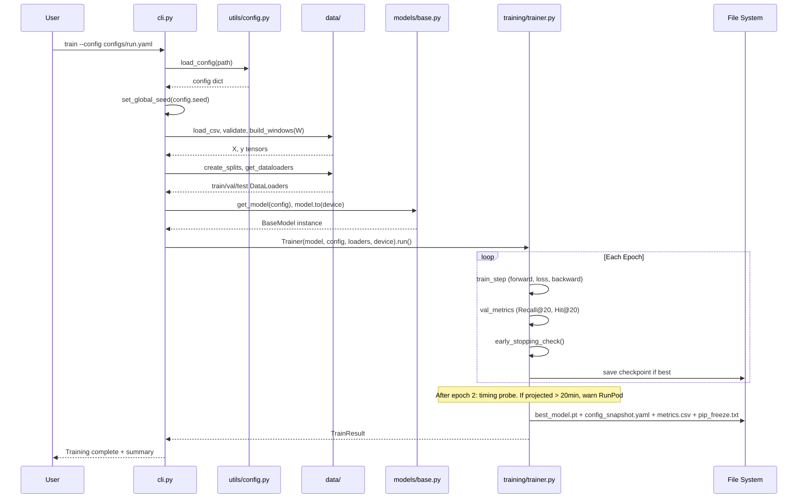
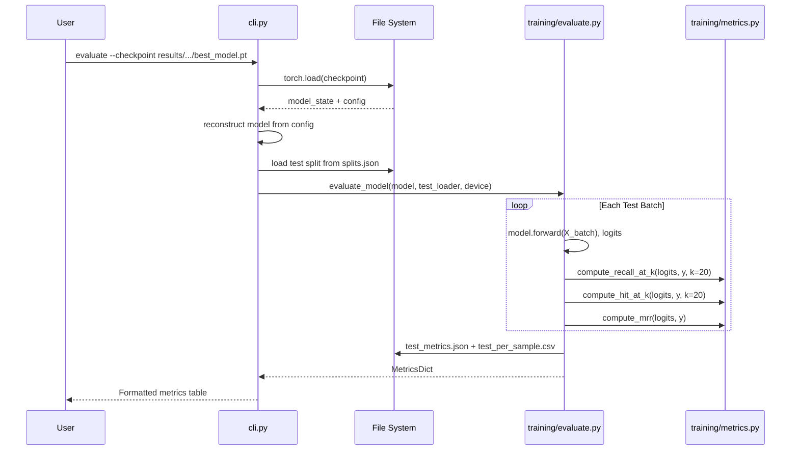
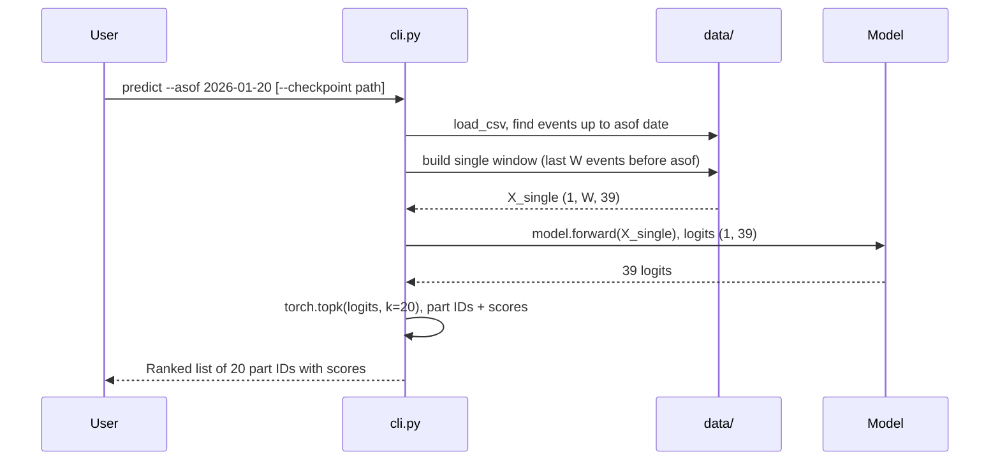

# c5_SNN Architecture Document

## 1. Introduction

This document outlines the overall project architecture for c5_SNN, a Spiking Neural Network time-series forecasting pipeline. Its primary goal is to serve as the guiding architectural blueprint for AI-driven development, ensuring consistency and adherence to chosen patterns and technologies.

### 1.1 Starter Template

N/A — Greenfield ML research project. No starter template, no existing codebase. Manual setup from scratch using `pyproject.toml` and `src/` layout.

### 1.2 Change Log

| Date       | Version | Description                                | Author               |
| ---------- | ------- | ------------------------------------------ | -------------------- |
| 2026-02-09 | 0.1     | Initial ChatGPT draft architecture         | ChatGPT / Roger      |
| 2026-02-10 | 1.0     | BMAD full architecture (this document)     | System Architect     |

---

## 2. High-Level Architecture

### 2.1 Technical Summary

c5_SNN is a single-service, config-driven ML research pipeline built in Python on PyTorch + snnTorch. It follows a **Pipeline Architecture** pattern — a linear chain of stages (validate → window → split → train → evaluate → report) where each stage transforms data artifacts on disk. All models (heuristic baselines, ANN, and three SNN phases) share a common interface via the **Strategy Pattern**: input `(batch, W, 39)` → output `(batch, 39)` logits. Experiment reproducibility is enforced through fixed seeds, config snapshots, and file-based artifact logging. This architecture directly supports PRD goals G1 (Top-20 ranking), G3 (reproducibility), and G4 (progressive SNN exploration).

### 2.2 High-Level Overview

1. **Architectural style:** Monolith — single Python package (`c5_snn`) with CLI entry point
2. **Repository structure:** Monorepo (PRD Section 4.1) — all source, configs, tests, and docs in one repository
3. **Service architecture:** Single-service ML research pipeline (PRD Section 4.2) — no API server, no microservices
4. **Primary data flow:** CSV file → validated DataFrame → windowed tensors → time-based splits → model training → evaluation metrics → comparison reports
5. **Key architectural decisions:**
   - Config-as-Code (YAML) for full experiment reproducibility
   - Strategy Pattern for model interchangeability
   - File-based artifact persistence (no database, no experiment tracker)
   - Dual-compute abstraction (local ROCm + RunPod CUDA via `torch.device`)

### 2.3 High-Level Project Diagram



### 2.4 Architectural and Design Patterns

- **Pipeline Architecture:** Linear data flow from raw CSV through validation, windowing, splitting, training, and evaluation. Each stage reads from and writes to well-defined file artifacts. — *Rationale:* Natural fit for ML experiment workflows; each stage is independently testable and re-runnable; aligns with PRD's CLI-command-per-stage design (FR10).

- **Strategy Pattern (Model Interface):** All models — heuristic, ANN, and SNN — implement the same `BaseModel` interface: `forward(x: Tensor) -> Tensor` with shape `(batch, W, 39) → (batch, 39)`. The trainer and evaluator are model-agnostic. — *Rationale:* Enables progressive model development (Epics 3–6) without modifying training or evaluation code; new models plug in by registering in `MODEL_REGISTRY`.

- **Config-as-Code:** Every experiment is fully specified by a YAML config file. The config is snapshotted alongside each checkpoint for provenance. — *Rationale:* Reproducibility (NFR1); enables hyperparameter sweeps by generating config variants; single source of truth for each run.

- **Registry Pattern:** Simple dict mapping string keys to model classes (`MODEL_REGISTRY`). Config `model.type` field selects the model at runtime. — *Rationale:* Avoids if/elif chains in the trainer; new models register with one line; YAML configs reference models by name.

---

## 3. Tech Stack

### 3.1 Compute Infrastructure

No traditional cloud provider. Local-first ML research pipeline with on-demand GPU rental:

- **Primary (development + short runs):** Local workstation — Ryzen 9 6900HX, 64GB RAM, AMD RX 6600M 8GB (ROCm)
- **Secondary (long training runs):** RunPod — NVIDIA B200 GPU (CUDA), used when projected training > 20 minutes locally
- **CI/CD:** GitHub Actions (free tier) — CPU-only for linting + unit tests
- **No cloud storage, no managed services, no containers**

### 3.2 Technology Stack Table

| Category | Technology | Version | Purpose | Rationale |
| --- | --- | --- | --- | --- |
| **Language** | Python | 3.11.11 | Primary development language | PRD requires 3.11+; 3.11 has best ML ecosystem compatibility; 3.12+ has C-extension issues with some ML libs |
| **ML Framework** | PyTorch | 2.5.1 | Deep learning, tensor operations, autograd | Industry standard for research; supports both ROCm 6.2 (local RX 6600M) and CUDA 12.4 (RunPod B200); stable release |
| **SNN Framework** | snnTorch | 0.9.1 | LIF neurons, surrogate gradients, spike encoding | PRD specifies snnTorch; aligns with SeqSNN paper methodology; Pythonic API on top of PyTorch; `Leaky`, `RLeaky`, `RSynaptic` neuron models |
| **Data** | pandas | 2.2.3 | CSV loading, data validation, date parsing | Mature DataFrame API for the tabular CA5 dataset |
| **Data** | NumPy | 1.26.4 | Array operations, seeding | PyTorch 2.5.x compatible; pinned < 2.0 to avoid breaking changes in downstream libs |
| **Config** | PyYAML | 6.0.2 | YAML experiment config parsing | Lightweight, standard for ML config files |
| **CLI** | Click | 8.1.8 | Command-line interface framework | Cleaner than argparse for multi-command CLIs; decorator-based, auto-generated help |
| **Progress** | tqdm | 4.67.1 | Training progress bars | Standard for ML training loops; minimal overhead |
| **Logging** | Python `logging` | stdlib | Runtime logging | PRD specifies Python logging module; zero extra dependencies |
| **Dev — Test** | pytest | 8.3.4 | Unit and integration tests | De facto Python test framework; fixtures, parametrize, good assertion introspection |
| **Dev — Lint** | Ruff | 0.8.6 | Linting + formatting | Replaces flake8+isort+black in one fast tool; Rust-based; PRD mentions ruff as option |
| **Dev — Type** | pyright | 1.1.391 | Static type checking | Lightweight type verification for ML code; no runtime cost; catches shape/interface bugs |
| **Serialization** | PyTorch `torch.save` | (bundled) | Checkpoint + tensor persistence | Native `.pt` format for model weights, windowed tensors, and split metadata |
| **VCS** | Git + GitHub | — | Version control, CI | Repository at <https://github.com/rogerfiske/c5_SNN> |
| **CI** | GitHub Actions | — | Automated test + lint on push/PR | Free tier sufficient; CPU-only runners for tests |

### 3.3 Dual-Compute Install Strategy

The RX 6600M (RDNA2, `gfx1032`) requires ROCm-specific PyTorch wheels. RunPod B200 uses CUDA wheels. The code itself is 100% device-agnostic via `torch.device`, but the install differs:

| Environment | PyTorch Install | GPU Backend |
| --- | --- | --- |
| Local (dev) | `pip install torch==2.5.1 --index-url https://download.pytorch.org/whl/rocm6.2` | ROCm 6.2 |
| RunPod (B200) | `pip install torch==2.5.1 --index-url https://download.pytorch.org/whl/cu124` | CUDA 12.4 |
| CI (GitHub Actions) | `pip install torch==2.5.1 --index-url https://download.pytorch.org/whl/cpu` | CPU only |

The `pyproject.toml` will specify `torch>=2.5.1,<2.6` as the dependency, with install instructions documenting the correct `--index-url` per environment.

**ROCm risk note:** The RX 6600M is a consumer RDNA2 GPU. ROCm officially targets data-center GPUs, but consumer RDNA2 works with `HSA_OVERRIDE_GFX_VERSION=10.3.0`. This should be validated in Story 1.1 as a smoke test. If ROCm proves unstable, the fallback is CPU-only local development + RunPod for all GPU training.

### 3.4 Dependency Graph

```text
c5_snn
├── torch 2.5.1         (ML framework)
├── snntorch 0.9.1      (SNN layers, depends on torch)
├── pandas 2.2.3        (data loading)
├── numpy 1.26.4        (array ops)
├── pyyaml 6.0.2        (config files)
├── click 8.1.8         (CLI)
└── tqdm 4.67.1         (progress bars)

[dev]
├── pytest 8.3.4        (testing)
├── ruff 0.8.6          (linting)
└── pyright 1.1.391     (type checking)
```

### 3.5 Key Decision: Why Not SpikingJelly?

The SeqSNN paper uses both snnTorch and SpikingJelly. This project uses snnTorch only:

- snnTorch has a simpler, more Pythonic API — better for iterative research
- It provides all needed neuron models (`Leaky`, `RLeaky`, `RSynaptic`) and surrogate gradients
- SpikingJelly's CuPy backend would add ROCm compatibility complexity
- Adding SpikingJelly later (v1.1+) is straightforward if needed for specific Spikformer ops

---

## 4. Data Models

This project has no database — all data lives in files. The "data models" here are the tensor structures, checkpoint bundles, and evaluation artifacts that flow through the pipeline.

### 4.1 Raw Input — CA5 Event Record

**Source:** `data/raw/CA5_matrix_binary.csv`

| Field | Type | Description |
| --- | --- | --- |
| `date` | `str` (ISO date) | Event date, monotonically non-decreasing |
| `m_1` .. `m_5` | `int` | Part IDs for this event (audit columns) |
| `P_1` .. `P_39` | `int {0,1}` | Multi-hot binary vector, exactly 5 ones per row |

- 11,700 rows, 45 columns
- Invariant: `sum(P_1..P_39) == 5` for every row
- Invariant: `{m_1..m_5}` matches the set of columns where `P_k == 1`

### 4.2 Windowed Tensor — Training Input

**Produced by:** `c5_snn.data.windowing` | **Stored at:** `data/processed/`

```text
X:  torch.Tensor  shape (N_samples, W, 39)   dtype float32
y:  torch.Tensor  shape (N_samples, 39)       dtype float32
```

| Attribute | Value | Notes |
| --- | --- | --- |
| `W` | 21 (default), range 7-90 | Configurable via YAML `data.window_size` |
| `N_samples` | `len(dataset) - W` | e.g., 11,700 - 21 = 11,679 |
| `X[t]` | P-vectors from events `[t, t+1, ..., t+W-1]` | Historical window |
| `y[t]` | P-vector of event `t+W` | Next-event target (multi-hot, 5 ones) |

**Persistence format:**

```text
data/processed/
├── X_w{W}.pt              # Windowed inputs
├── y_w{W}.pt              # Targets
└── tensor_meta_w{W}.json  # Metadata
```

**`tensor_meta_w{W}.json` schema:**

```json
{
  "source_file": "data/raw/CA5_matrix_binary.csv",
  "source_hash": "sha256:abc123...",
  "window_size": 21,
  "n_samples": 11679,
  "n_features": 39,
  "date_range": ["1992-01-15", "2026-01-20"],
  "created_at": "2026-02-10T14:30:00Z"
}
```

### 4.3 Split Index — Train/Val/Test Partition

**Produced by:** `c5_snn.data.splits` | **Stored at:** `data/processed/splits.json`

```json
{
  "window_size": 21,
  "ratios": {"train": 0.70, "val": 0.15, "test": 0.15},
  "indices": {
    "train": [0, 8175],
    "val": [8175, 9927],
    "test": [9927, 11679]
  },
  "date_ranges": {
    "train": ["1992-01-15", "2015-06-12"],
    "val": ["2015-06-13", "2019-11-04"],
    "test": ["2019-11-05", "2026-01-20"]
  },
  "counts": {"train": 8175, "val": 1752, "test": 1752}
}
```

- Key invariant: all train indices < all val indices < all test indices (time-ordered, no shuffle)
- Indices are half-open ranges `[start, end)` into the windowed tensor arrays

### 4.4 Experiment Config — YAML

**Location:** `configs/` directory, one file per experiment

```yaml
# configs/snn_phase_a_mlp.yaml
experiment:
  name: "snn_phase_a_mlp_v1"
  seed: 42

data:
  raw_path: "data/raw/CA5_matrix_binary.csv"
  window_size: 21
  split_ratios: [0.70, 0.15, 0.15]
  batch_size: 64

model:
  type: "spiking_mlp"           # registry key
  hidden_sizes: [256, 128]
  beta: 0.95
  encoding: "direct"            # "direct" | "rate_coded"
  surrogate: "fast_sigmoid"
  cardinality_penalty: 0.0

training:
  epochs: 100
  learning_rate: 0.001
  optimizer: "adam"
  early_stopping_patience: 10
  early_stopping_metric: "val_recall_at_20"

output:
  dir: "results/snn_phase_a_mlp_v1"
```

### 4.5 Model Checkpoint Bundle

**Produced by:** `c5_snn.training.trainer` | **Stored at:** `results/{experiment_name}/`

```text
results/snn_phase_a_mlp_v1/
├── best_model.pt              # torch.save() dict (see below)
├── config_snapshot.yaml       # Frozen copy of experiment config
├── metrics.csv                # Per-epoch: epoch, train_loss, val_recall_at_20, val_hit_at_20
├── pip_freeze.txt             # pip freeze output (NFR1)
└── evaluation/                # Populated by evaluate command
    ├── test_metrics.json      # Aggregate metrics
    └── test_per_sample.csv    # Per-sample predictions + metrics
```

**`best_model.pt` contents** (saved via `torch.save`):

```python
{
    "model_state_dict": model.state_dict(),
    "optimizer_state_dict": optimizer.state_dict(),
    "epoch": best_epoch,
    "best_val_recall_at_20": 0.847,
    "config": config_dict,
    "seed": 42
}
```

### 4.6 Evaluation Artifacts

**`test_metrics.json` schema:**

```json
{
  "model_name": "snn_phase_a_mlp_v1",
  "checkpoint": "results/snn_phase_a_mlp_v1/best_model.pt",
  "split": "test",
  "n_samples": 1752,
  "metrics": {
    "recall_at_20": 0.847,
    "hit_at_20": 0.962,
    "recall_at_5": 0.412,
    "hit_at_5": 0.673,
    "mrr": 0.534
  },
  "evaluated_at": "2026-02-15T10:00:00Z"
}
```

**`test_per_sample.csv` columns:**

```text
sample_idx, date, true_parts, predicted_top20, recall_at_20, hit_at_20, recall_at_5, hit_at_5
```

### 4.7 Comparison Report

**`results/final_comparison.json` schema:**

```json
{
  "models": [
    {
      "name": "frequency_baseline",
      "type": "heuristic",
      "phase": "baseline",
      "metrics_mean": {"recall_at_20": 0.65},
      "metrics_std": {"recall_at_20": 0.0},
      "n_seeds": 1,
      "training_time_s": 0,
      "environment": "local"
    }
  ],
  "generated_at": "2026-03-01T12:00:00Z",
  "window_size": 21,
  "test_split_size": 1752
}
```

### 4.8 Data Model Relationships



---

## 5. Components

Five logical modules inside `src/c5_snn/`, each with clear boundaries and a single responsibility.

### 5.1 Data Module — `c5_snn.data`

**Responsibility:** Load, validate, and transform raw CSV into training-ready tensors and splits.

**Key Interfaces:**

- `load_csv(path: str) -> pd.DataFrame` — load raw data
- `validate(df: pd.DataFrame) -> ValidationReport` — run all integrity checks (FR1)
- `build_windows(df: pd.DataFrame, W: int) -> tuple[Tensor, Tensor]` — produce `(X, y)` tensors (FR2)
- `create_splits(n_samples: int, ratios: tuple, W: int) -> SplitInfo` — time-based split indices (FR3)
- `get_dataloaders(splits: SplitInfo, X, y, batch_size) -> dict[str, DataLoader]` — PyTorch DataLoaders

**Dependencies:** pandas, numpy, torch (tensors only)

**Internal files:**

| File | Purpose |
| --- | --- |
| `loader.py` | CSV loading, column validation |
| `validation.py` | Integrity checks: row sums, monotonic dates, m/P cross-check |
| `windowing.py` | Sliding window tensor construction, `.pt` persistence |
| `splits.py` | Time-based splitting, `splits.json` persistence |
| `dataset.py` | `torch.utils.data.Dataset` wrapper, DataLoader factory |

### 5.2 Models Module — `c5_snn.models`

**Responsibility:** Define all model architectures behind a common interface. The Strategy Pattern ensures every model — heuristic, ANN, or SNN — is interchangeable.

**Common Interface (abstract):**

```python
class BaseModel(nn.Module):
    """All models implement this contract."""
    def forward(self, x: Tensor) -> Tensor:
        """Input: (batch, W, 39) -> Output: (batch, 39) logits"""
        ...
```

**Key Interfaces:**

- `get_model(config: dict) -> BaseModel` — registry lookup by `config["model"]["type"]`
- Each model's `forward()` takes `(batch, W, 39)` and returns `(batch, 39)` logits

**Dependencies:** torch, snntorch (SNN models only)

**Internal files:**

| File | Purpose | PRD Ref |
| --- | --- | --- |
| `base.py` | `BaseModel` ABC + model registry dict | FR4-FR7 |
| `baselines.py` | `FrequencyBaseline`, `GRUBaseline` | FR4 |
| `encoding.py` | `SpikeEncoder` — direct + rate-coded modes | FR5 |
| `snn_phase_a.py` | `SpikingMLP`, `SpikingCNN1D` | FR5 |
| `snn_phase_b.py` | `SpikeGRU` using snnTorch `RLeaky`/`RSynaptic` | FR6 |
| `snn_phase_c.py` | `SpikingTransformer` with SSA + positional encoding | FR7 |

**Model Registry:**

```python
MODEL_REGISTRY = {
    "frequency_baseline": FrequencyBaseline,
    "gru_baseline": GRUBaseline,
    "spiking_mlp": SpikingMLP,
    "spiking_cnn1d": SpikingCNN1D,
    "spike_gru": SpikeGRU,
    "spiking_transformer": SpikingTransformer,
}
```

### 5.3 Training Module — `c5_snn.training`

**Responsibility:** Train any model, compute metrics, evaluate checkpoints, and produce comparison reports.

**Key Interfaces:**

- `Trainer(model, config, dataloaders, device).run() -> TrainResult` — full training loop with early stopping
- `evaluate_model(model, dataloader, device) -> MetricsDict` — compute all metrics on a split
- `compute_recall_at_k(preds, targets, k) -> float` — individual metric functions
- `build_comparison(results: list[MetricsDict]) -> ComparisonReport` — multi-model leaderboard

**Dependencies:** torch, c5_snn.models (via BaseModel interface), c5_snn.data (DataLoaders)

**Internal files:**

| File | Purpose | PRD Ref |
| --- | --- | --- |
| `trainer.py` | Training loop: forward, loss, backward, val, checkpoint, early stop | FR8, FR11 |
| `metrics.py` | Recall@K, Hit@K, MRR computation | FR9 |
| `evaluate.py` | Full evaluation harness: inference + metrics + JSON/CSV export | FR9, FR12 |
| `compare.py` | Cross-model comparison report generation | Story 3.4, 5.3, 6.4 |

**Trainer responsibilities:**

- BCEWithLogitsLoss + optional cardinality penalty (FR8)
- Early stopping on `val_recall_at_20` with configurable patience
- Best checkpoint save with config snapshot + pip freeze (FR11, NFR1)
- 2-epoch timing probe with RunPod warning (NFR3)
- Per-epoch metrics CSV logging (NFR4)

### 5.4 CLI Module — `c5_snn.cli`

**Responsibility:** Single entry point for all user-facing commands (FR10).

**Key Interfaces (Click commands):**

- `validate-data [--data-path PATH]` — run data validation
- `train --config PATH` — train a model from YAML config
- `evaluate --checkpoint PATH [--output-dir PATH]` — evaluate a saved model
- `predict --asof YYYY-MM-DD [--checkpoint PATH]` — produce Top-20 prediction for a date

**Dependencies:** click, c5_snn.data, c5_snn.models, c5_snn.training

**Internal files:**

| File | Purpose |
| --- | --- |
| `cli.py` | Click group + all four subcommands |

Single file — the CLI is thin orchestration that delegates to data/models/training modules. No business logic in the CLI layer.

### 5.5 Utils Module — `c5_snn.utils`

**Responsibility:** Cross-cutting infrastructure used by all other modules.

**Key Interfaces:**

- `set_global_seed(seed: int)` — sets `random`, `numpy`, `torch.manual_seed`, `torch.cuda.manual_seed_all`
- `setup_logging(level: str, log_file: str | None)` — configure Python logging
- `load_config(path: str) -> dict` — YAML config loading with basic validation
- `get_device() -> torch.device` — auto-detect CPU / CUDA / ROCm

**Dependencies:** stdlib only (+ torch for device detection, pyyaml for config)

**Internal files:**

| File | Purpose | PRD Ref |
| --- | --- | --- |
| `seed.py` | Deterministic seed management | NFR1 |
| `logging.py` | Logging setup | NFR4 |
| `config.py` | YAML config loader | Tech Assumption 4.4 |
| `device.py` | `torch.device` detection + ROCm `HSA_OVERRIDE_GFX_VERSION` hint | NFR3 |

### 5.6 Component Interaction Diagram



---

## 6. External APIs

N/A — No external service integrations. The pipeline is entirely local with optional manual SSH to RunPod.

---

## 7. Core Workflows

The four CLI commands define four distinct workflows through the components.

### 7.1 Workflow: validate-data



### 7.2 Workflow: train --config



### 7.3 Workflow: evaluate --checkpoint



### 7.4 Workflow: predict --asof



---

## 8. REST API Spec

N/A — CLI-only pipeline. No API server.

---

## 9. Database Schema

N/A — File-based persistence only. All data models are documented in Section 4.

---

## 10. Source Tree

```text
c5_SNN/
├── .github/
│   └── workflows/
│       └── ci.yml                    # GitHub Actions: pytest + ruff on push/PR
├── configs/
│   ├── default.yaml                  # Base config with shared defaults
│   ├── baseline_frequency.yaml       # Frequency heuristic config
│   ├── baseline_gru.yaml             # GRU baseline config
│   ├── snn_phase_a_mlp.yaml          # Spiking MLP config
│   ├── snn_phase_a_cnn.yaml          # Spiking 1D-CNN config
│   ├── snn_phase_b.yaml              # Spike-GRU config
│   └── snn_phase_c.yaml              # Spiking Transformer config
├── data/
│   ├── raw/
│   │   └── CA5_matrix_binary.csv     # Source data (11,700 x 45) -- gitignored
│   └── processed/                    # Generated artifacts -- gitignored
│       ├── X_w21.pt
│       ├── y_w21.pt
│       ├── tensor_meta_w21.json
│       └── splits.json
├── docs/
│   ├── architecture.md               # This document
│   ├── concept.md                    # Project concept brief
│   ├── prd.md                        # BMAD PRD
│   └── project-memory.md             # Running decisions log
├── docs-imported/
│   ├── pc_specs.md                   # Hardware reference
│   └── Spike_Neural_Networks.pdf     # SeqSNN paper reference
├── results/                          # All experiment outputs -- gitignored
│   ├── baseline_frequency/
│   │   ├── best_model.pt
│   │   ├── config_snapshot.yaml
│   │   ├── metrics.csv
│   │   ├── pip_freeze.txt
│   │   └── evaluation/
│   │       ├── test_metrics.json
│   │       └── test_per_sample.csv
│   ├── baseline_gru/
│   ├── snn_phase_a_mlp/
│   ├── snn_phase_a_cnn/
│   ├── snn_phase_b/
│   ├── snn_phase_c/
│   ├── phase_a_comparison.json
│   ├── cumulative_comparison.json
│   ├── window_tuning.csv
│   ├── final_comparison.json
│   └── final_report.md
├── src/
│   └── c5_snn/
│       ├── __init__.py               # Package version: 0.1.0
│       ├── cli.py                    # Click CLI: validate-data, train, evaluate, predict
│       ├── data/
│       │   ├── __init__.py
│       │   ├── loader.py             # CSV loading
│       │   ├── validation.py         # Data integrity checks
│       │   ├── windowing.py          # Sliding window tensor construction
│       │   ├── splits.py             # Time-based train/val/test splitting
│       │   └── dataset.py            # PyTorch Dataset + DataLoader factory
│       ├── models/
│       │   ├── __init__.py
│       │   ├── base.py               # BaseModel ABC + MODEL_REGISTRY
│       │   ├── baselines.py          # FrequencyBaseline, GRUBaseline
│       │   ├── encoding.py           # SpikeEncoder (direct + rate-coded)
│       │   ├── snn_phase_a.py        # SpikingMLP, SpikingCNN1D
│       │   ├── snn_phase_b.py        # SpikeGRU
│       │   └── snn_phase_c.py        # SpikingTransformer
│       ├── training/
│       │   ├── __init__.py
│       │   ├── trainer.py            # Training loop, early stopping, checkpointing
│       │   ├── metrics.py            # Recall@K, Hit@K, MRR
│       │   ├── evaluate.py           # Evaluation harness + report export
│       │   └── compare.py            # Multi-model comparison reports
│       └── utils/
│           ├── __init__.py
│           ├── seed.py               # set_global_seed()
│           ├── logging.py            # setup_logging()
│           ├── config.py             # YAML config loader
│           └── device.py             # get_device() -- CPU/CUDA/ROCm
├── tests/
│   ├── conftest.py                   # Shared fixtures (tiny CSV, small tensors)
│   ├── test_validation.py            # Data validation checks
│   ├── test_windowing.py             # Window shapes, alignment, edge cases
│   ├── test_splits.py                # No-overlap, ordering, round-trip
│   ├── test_metrics.py               # Hand-crafted metric verification
│   ├── test_models.py                # Forward/backward shape checks per model
│   ├── test_seed.py                  # Deterministic reproducibility
│   └── test_integration.py           # End-to-end tiny run (N rows, 2 epochs)
├── scripts/                          # Utility scripts (optional)
│   └── runpod_setup.sh               # RunPod environment bootstrap
├── .gitignore                        # data/raw/, data/processed/, results/, __pycache__, .mypy_cache
├── pyproject.toml                    # Package metadata, dependencies, [dev] extras
└── README.md                         # Setup + usage instructions
```

---

## 11. Infrastructure and Deployment

This is a research pipeline, not a deployed service. "Deployment" means: can I reproduce the experiment?

### 11.1 Environments

| Environment | Purpose | Hardware | Setup |
| --- | --- | --- | --- |
| **Local (dev)** | Development, short training, all testing | Ryzen 9 6900HX, 64GB, RX 6600M 8GB | `pip install -e ".[dev]"` + ROCm PyTorch wheel |
| **RunPod (GPU)** | Long training runs (>20 min projected) | NVIDIA B200 | `pip install -e .` + CUDA PyTorch wheel |
| **GitHub Actions (CI)** | Lint + unit/integration tests on push/PR | GitHub-hosted runner (CPU) | `pip install -e ".[dev]"` + CPU PyTorch wheel |

### 11.2 CI Pipeline

```text
Push / PR to main
  -> checkout
  -> Python 3.11 setup
  -> pip install -e ".[dev]" (CPU torch)
  -> ruff check src/
  -> pytest tests/ -v --ignore=tests/test_integration.py  (unit tests, fast)
  -> pytest tests/test_integration.py -v                   (integration, tiny data)
```

No deployment pipeline. No staging. No production. Artifacts live in `results/` locally and are committed selectively (configs + reports yes, large `.pt` checkpoints no).

### 11.3 Rollback Strategy

Not applicable — this is iterative research. If a model is bad, you train a new one. Old checkpoints are preserved alongside their configs.

---

## 12. Error Handling Strategy

Lightweight — single-user research pipeline, not a production service.

### 12.1 General Approach

- **Error Model:** Fail-fast with clear messages. If data is bad or config is wrong, crash immediately with a descriptive error rather than silently producing garbage results.
- **Exception Hierarchy:**

```python
class C5SNNError(Exception):
    """Base exception for the pipeline."""

class DataValidationError(C5SNNError):
    """Raised when input data fails integrity checks."""

class ConfigError(C5SNNError):
    """Raised when YAML config is missing required fields or has invalid values."""

class TrainingError(C5SNNError):
    """Raised when training encounters an unrecoverable error (NaN loss, OOM)."""
```

- **Error Propagation:** Exceptions bubble up to the CLI layer, which catches `C5SNNError` subclasses, logs the message, and exits with non-zero code. Unexpected exceptions propagate with full traceback.

### 12.2 Logging Standards

- **Library:** Python `logging` (stdlib)
- **Format:** `%(asctime)s [%(levelname)s] %(name)s: %(message)s`
- **Levels:**
  - `DEBUG` — tensor shapes, batch timing, per-step loss
  - `INFO` — epoch summaries, checkpoint saves, workflow start/end
  - `WARNING` — RunPod timing recommendation, deprecated config keys, ROCm fallback
  - `ERROR` — validation failures, NaN loss, file not found
- **Default level:** `INFO` (configurable via YAML `log_level` or `--verbose` flag)
- **File output:** Optional log file alongside experiment results (`results/{name}/training.log`)

### 12.3 Error Patterns

| Category | Pattern | Example |
| --- | --- | --- |
| **Data errors** | Fail immediately, report all violations at once | "Validation failed: 3 rows have row_sum != 5 (indices: 42, 1003, 8891)" |
| **Config errors** | Fail at load time, before any computation | "ConfigError: model.type 'spike_gru' not found in MODEL_REGISTRY" |
| **Training errors** | Detect NaN/Inf loss, stop training, save last valid checkpoint | "TrainingError: NaN loss at epoch 12, batch 34. Last valid checkpoint saved." |
| **Device errors** | Detect at startup, fall back to CPU with warning | "WARNING: ROCm not available, falling back to CPU" |
| **File I/O** | Standard Python exceptions, let them propagate | FileNotFoundError for missing checkpoint |

### 12.4 No Retry Logic

No retries, circuit breakers, or idempotency patterns needed. There are no external APIs, no network calls (except RunPod SSH which is manual), and no concurrent users.

---

## 13. Coding Standards

These are mandatory rules for the AI dev agent. Kept minimal — only project-specific rules that an AI might otherwise violate.

### 13.1 Core Standards

- **Language:** Python 3.11, type hints on all public function signatures
- **Linting:** Ruff — `ruff check src/ tests/` must pass with zero errors
- **Formatting:** Ruff format — `ruff format src/ tests/`
- **Test files:** `tests/test_{module}.py` mirroring `src/c5_snn/{module}.py`

### 13.2 Naming Conventions

| Element | Convention | Example |
| --- | --- | --- |
| Modules / files | `snake_case.py` | `snn_phase_a.py` |
| Classes | `PascalCase` | `SpikingMLP`, `SpikeGRU` |
| Functions / methods | `snake_case` | `build_windows()`, `compute_recall_at_k()` |
| Constants | `UPPER_SNAKE` | `MODEL_REGISTRY`, `DEFAULT_WINDOW_SIZE` |
| Config keys | `snake_case` (YAML) | `window_size`, `learning_rate` |
| Experiment dirs | `{model_type}_v{N}` or `{model_type}_seed{S}` | `snn_phase_a_mlp_v1` |

### 13.3 Critical Rules

These prevent the most likely AI mistakes in an ML research codebase:

1. **No data leakage** — When constructing windows or splits, NEVER access data at index `t+W` or beyond as input. Target `y[t]` is event `t+W`, input `X[t]` is events `[t..t+W-1]`. All feature engineering uses only the input window. Test this explicitly.

2. **Device-agnostic tensors** — NEVER hardcode `.cuda()`. Always use `.to(device)` where `device = get_device()`. This applies to models, tensors, and loss functions.

3. **Seed before everything** — Call `set_global_seed(config.seed)` as the first action in any training or evaluation run, before model construction, data loading, or shuffling.

4. **Config is immutable at runtime** — Load the YAML config once, snapshot it to `config_snapshot.yaml` in the output dir, and never mutate it during training. This ensures checkpoint provenance.

5. **Common model interface** — Every model MUST subclass `BaseModel` and implement `forward(x: Tensor) -> Tensor` with signature `(batch, W, 39) -> (batch, 39)`. No exceptions. The trainer and evaluator depend on this contract.

6. **No `print()` in library code** — Use `logging.getLogger(__name__)` exclusively. `print()` is acceptable only in CLI output formatting.

7. **Checkpoint completeness** — Every `torch.save` checkpoint MUST include `model_state_dict`, `optimizer_state_dict`, `epoch`, `best_val_recall_at_20`, `config`, and `seed`. A checkpoint without its config is useless.

8. **Test with tiny data** — Integration tests use the first N rows (e.g., 50-100) and W=5 to run fast. Never load the full 11,700-row dataset in tests.

### 13.4 Python / ML Specifics

- **Imports:** stdlib then third-party then local, enforced by Ruff (`isort` rules)
- **Type hints:** Required on public functions; optional on internal/private helpers
- **Docstrings:** Required on classes and public functions; Google-style format
- **Tensor shapes:** Document expected shapes in docstrings: `x: Tensor  # (batch, W, 39)`
- **snnTorch layers:** Always pass `init_hidden=True` for stateful neurons; reset states between batches via `model.reset_hidden()`

---

## 14. Test Strategy and Standards

### 14.1 Philosophy

- **Approach:** Test-alongside — write tests for each story as part of story delivery, not as a separate phase
- **Coverage goal:** 80%+ on `data/` and `training/metrics.py` (correctness-critical), relaxed on model internals (shape tests sufficient)
- **Test pyramid:** Heavy unit tests, one integration test, no E2E (no UI)

### 14.2 Unit Tests

- **Framework:** pytest 8.3.4
- **Location:** `tests/test_{module}.py`
- **Fixtures** (`tests/conftest.py`):
  - `tiny_csv` — 20-row valid CSV as a DataFrame
  - `bad_csv_*` — CSVs with specific violations (wrong row sum, missing column, etc.)
  - `sample_windows` — pre-built `(X, y)` tensors with W=5, 10 samples
  - `sample_config` — minimal valid YAML config as dict

| Test File | Covers | Key Assertions |
| --- | --- | --- |
| `test_validation.py` | `data/validation.py` | Pass on valid data; fail on each violation type; report lists all errors |
| `test_windowing.py` | `data/windowing.py` | Output shapes correct; first/last window alignment; no target leak; empty result for tiny data |
| `test_splits.py` | `data/splits.py` | No index overlap; strict ordering; round-trip `splits.json`; ratio changes work |
| `test_metrics.py` | `training/metrics.py` | Perfect=1.0; zero=0.0; known partial overlap; MRR hand-computed |
| `test_models.py` | All model `forward()` | Input `(4, W, 39)` -> output `(4, 39)` for every registered model; backward completes |
| `test_seed.py` | `utils/seed.py` | Two calls with same seed produce identical random sequences across random/numpy/torch |

### 14.3 Integration Test

- **File:** `tests/test_integration.py`
- **Scope:** Full pipeline on tiny data — load first 100 rows, validate, window (W=5), split, train GRU baseline 2 epochs, evaluate, verify output files exist with correct structure
- **Runtime target:** < 30 seconds on CPU
- **CI:** Runs after unit tests in the GitHub Actions pipeline

### 14.4 What We Don't Test

- Model convergence or accuracy (that's the research itself, not a regression target)
- GPU-specific behavior (CI is CPU-only; GPU validation is manual)
- RunPod connectivity
- Checkpoint size or training speed (non-deterministic)

### 14.5 Test Data Management

- **Fixtures only** — small, deterministic, checked into the repo inside `tests/conftest.py` (generated programmatically, not from real data)
- **No real data in tests** — `data/raw/CA5_matrix_binary.csv` is gitignored and never referenced in tests
- **Cleanup:** Tests use `tmp_path` (pytest built-in) for any file output; auto-cleaned after each run

---

## 15. Security

Lightweight — single-user local research pipeline, no network services, no user auth, no PII.

### 15.1 Threat Surface

This project has a minimal threat surface:

- No API server, no open ports, no network listeners
- No user authentication or authorization
- No PII or sensitive business data (the CA5 dataset is research data)
- No cloud services beyond GitHub (public repo) and ad-hoc RunPod SSH

### 15.2 Applicable Security Concerns

| Concern | Mitigation |
| --- | --- |
| **Secrets in git** | `.gitignore` excludes `data/raw/`, `data/processed/`, `results/`. No API keys or credentials in this project. RunPod SSH keys live in `~/.ssh/`, never in the repo. |
| **Dependency vulnerabilities** | Pin all versions in `pyproject.toml`. GitHub Dependabot enabled on the repo for automated alerts. |
| **Pickle deserialization** | Only load checkpoints that this pipeline produced. Never load `.pt` files from untrusted sources. Use `weights_only=True` in `torch.load()` where possible (PyTorch 2.5+ default). |
| **CI runner security** | GitHub Actions uses GitHub-hosted runners. No self-hosted runners. No secrets in CI. |

---

## 16. Checklist Results Report

### Executive Summary

- **Overall completeness:** ~95%
- **MVP scope appropriateness:** Just Right
- **Readiness for development:** **READY**
- **Most critical gap:** ROCm + snnTorch compatibility unvalidated (mitigated by early smoke test)

### Section Statuses

| Section | Status | Notes |
| --- | --- | --- |
| Introduction | PASS | Starter template = N/A, change log present |
| High-Level Architecture | PASS | Technical summary, overview, mermaid diagram, 4 patterns with rationale |
| Tech Stack | PASS | 15 technologies pinned, dual-compute strategy, ROCm risk noted |
| Data Models | PASS | 7 data models covering full artifact lifecycle |
| Components | PASS | 5 modules with interfaces, deps, file listings, interaction diagram |
| External APIs | SKIP | N/A |
| Core Workflows | PASS | 4 sequence diagrams for all CLI commands |
| REST API / DB Schema | SKIP | N/A |
| Source Tree | PASS | Full tree with every file, purpose annotations |
| Infrastructure | PASS | 3 environments, CI pipeline documented |
| Error Handling | PASS | Custom exceptions, logging standards, fail-fast |
| Coding Standards | PASS | 8 critical rules, naming conventions, ML-specific guidelines |
| Test Strategy | PASS | Unit + integration, fixtures, 80% coverage goal |
| Security | PASS | Lightweight, threat surface minimal |

### PRD Traceability

| PRD Requirement | Architecture Coverage |
| --- | --- |
| FR1 (validate data) | `data/validation.py` + `validate-data` workflow |
| FR2 (windowed tensors) | `data/windowing.py` + Data Model 4.2 |
| FR3 (time-based splits) | `data/splits.py` + Data Model 4.3 |
| FR4 (baselines) | `models/baselines.py` — FrequencyBaseline, GRUBaseline |
| FR5 (SNN Phase A) | `models/snn_phase_a.py` + `models/encoding.py` |
| FR6 (SNN Phase B) | `models/snn_phase_b.py` — SpikeGRU |
| FR7 (SNN Phase C) | `models/snn_phase_c.py` — SpikingTransformer |
| FR8 (BCEWithLogitsLoss) | `training/trainer.py` |
| FR9 (evaluation harness) | `training/metrics.py` + `training/evaluate.py` |
| FR10 (CLI commands) | `cli.py` — all 4 commands specified |
| FR11 (checkpoint + config) | Checkpoint bundle (Data Model 4.5) |
| FR12 (Top-20 output) | `predict` workflow + `evaluate.py` |
| NFR1 (reproducibility) | `utils/seed.py` + `pip_freeze.txt` + config snapshots |
| NFR2 (no data leakage) | Critical Rule #1 + `test_windowing.py` + `test_splits.py` |
| NFR3 (20-min probe) | Trainer 2-epoch timing probe |
| NFR4 (experiment logging) | `metrics.csv` + `test_metrics.json` per run |
| NFR5 (testing) | Full test strategy with unit + integration |
| NFR6 (ONNX export) | Deferred to v1.1+ (documented) |

### Trade-offs

| Decision | Trade-off | Rationale |
| --- | --- | --- |
| snnTorch only (no SpikingJelly) | Lose CuPy-accelerated spike ops | Simpler stack, avoids ROCm/CuPy conflict |
| Click over argparse | Extra dependency | Cleaner multi-command CLI, auto-help |
| NumPy 1.26 (not 2.x) | Miss NumPy 2.0 perf gains | Avoids breaking changes in transitive deps |
| File-based artifacts (no MLflow/W&B) | No experiment dashboard UI | Zero external deps, full reproducibility from files alone |
| Python 3.11 (not 3.12+) | Miss some perf improvements | Better ML ecosystem compatibility |
| `torch.save` (not safetensors) | Pickle-based serialization | Native PyTorch format, includes optimizer state |

---

## 17. Next Steps

### 17.1 Dev Agent Handoff Prompt

> Review `docs/architecture.md` for the complete architectural blueprint. Use `docs/prd.md` for requirements and story details. Begin with **Epic 1, Story 1.1: Repository & Package Scaffold**. Follow the source tree layout exactly as specified in Section 10. Use the tech stack versions pinned in Section 3.2 for `pyproject.toml`. Apply the 8 critical coding rules from Section 13.3 to all code. Run `ruff check` and `pytest` before marking any story complete.

### 17.2 Architecture Decisions Requiring Early Validation

1. **ROCm smoke test** (Story 1.1): Verify `import torch; torch.cuda.is_available()` works on the RX 6600M with `HSA_OVERRIDE_GFX_VERSION=10.3.0`
2. **snnTorch compatibility** (Story 4.1): Verify `import snntorch` works with PyTorch 2.5.1 on both ROCm and CUDA
3. If either fails, fallback: CPU-only local dev + all GPU training on RunPod B200
